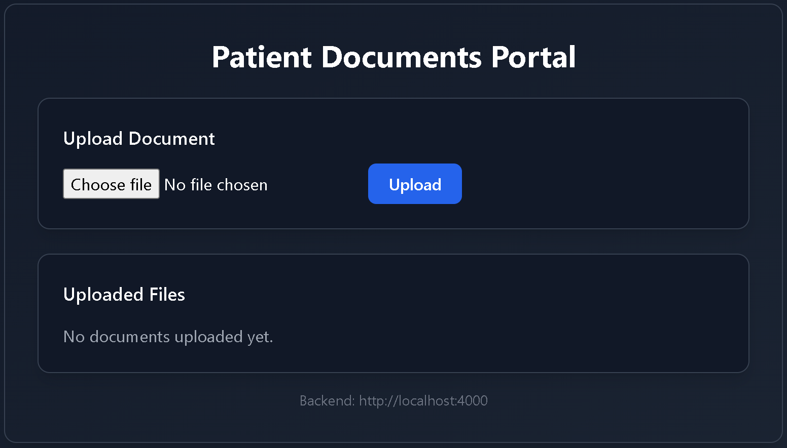
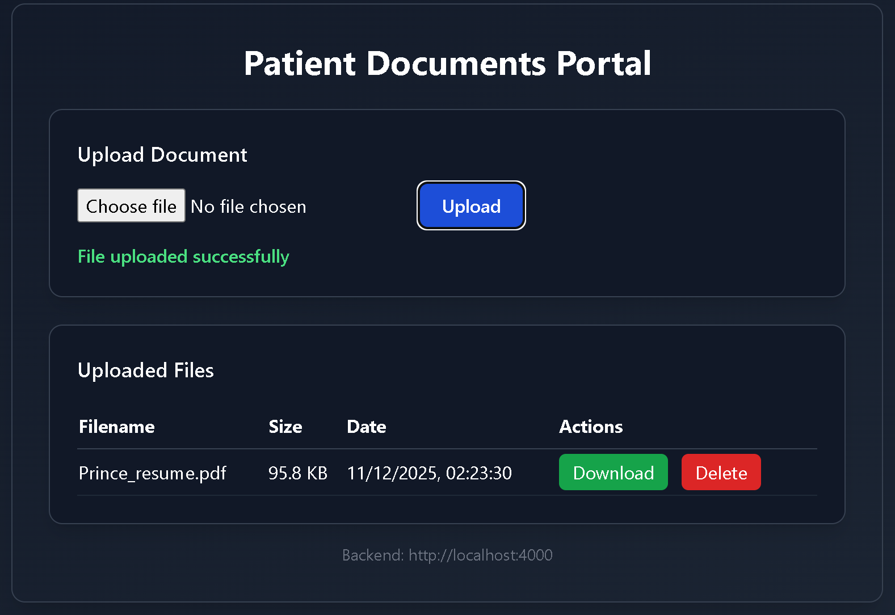
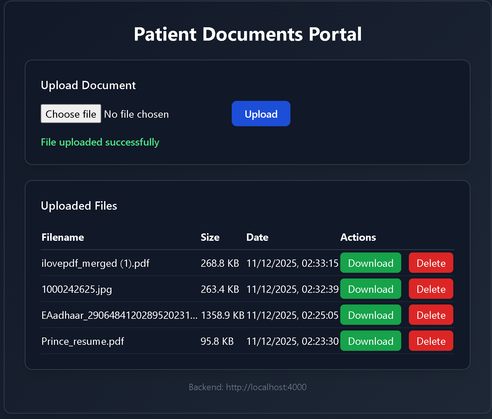
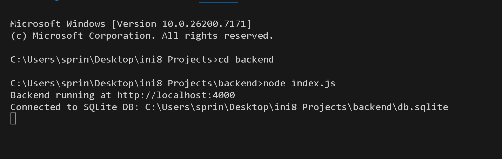

# Patient Documents Portal

This patient document portal allows a user to upload, view, download, and delete medical PDF/image files. The system uses:

- Node.js + Express for backend API
- SQLite for file metadata
- Local uploads folder for file storage
- React + Tailwind CSS for UI
- REST APIs to manage documents
- This project fulfills all core requirements as listed in the assignment.


## Features
- Upload PDF, PNG, or JPG files (max 10 MB)
- View list of uploaded documents
- Download files
- Delete files
- Stores files locally in `uploads/`
- Stores metadata in SQLite database


## Tech Stack
- **Frontend:** React (Vite)
- **Backend:** Node.js + Express
- **Database:** SQLite
- **File Storage:** Local `/uploads` folder


## Project Structure
```
project/
  backend/
    index.js
    db.js
    db.sqlite
    uploads/
  frontend/
    src/
    index.css
    App.jsx
  design.md
  README.md
```


## How to Run Locally

### 1. Start backend Setup
```
cd backend
npm install
node index.js
```
Backend will run on:
```
http://localhost:4000
```


### 2. Start frontend Setup
```
cd frontend
npm install
npm run dev
```
Frontend will run on:
```
http://localhost:5173
```


## API Endpoints

## API Endpoints

| Endpoint               | Method | Description        |
|-----------------------|--------|--------------------|
| /documents/upload     | POST   | Upload a file      |
| /documents            | GET    | List all files     |
| /documents/:id        | GET    | Download a file    |
| /documents/:id        | DELETE | Delete a file      |


## Example cURL Commands

### Upload a File
```
curl -F "file=@test.pdf" http://localhost:4000/documents/upload
```

### List Files
```
curl http://localhost:4000/documents
```

### Download a File
```
curl -o file.pdf http://localhost:4000/documents/1
```

### Delete a File
```
curl -X DELETE http://localhost:4000/documents/1
```
## Requirements
- Node.js installed
- SQLite database automatically created
- Folder `uploads/` writable by server

## Notes
- This app does not implement authentication
- Designed for local use
- For deployment, use S3 or a database storage

## Screenshots

### Upload Screen


### Upload Success


### Documents List


### Backend Running



